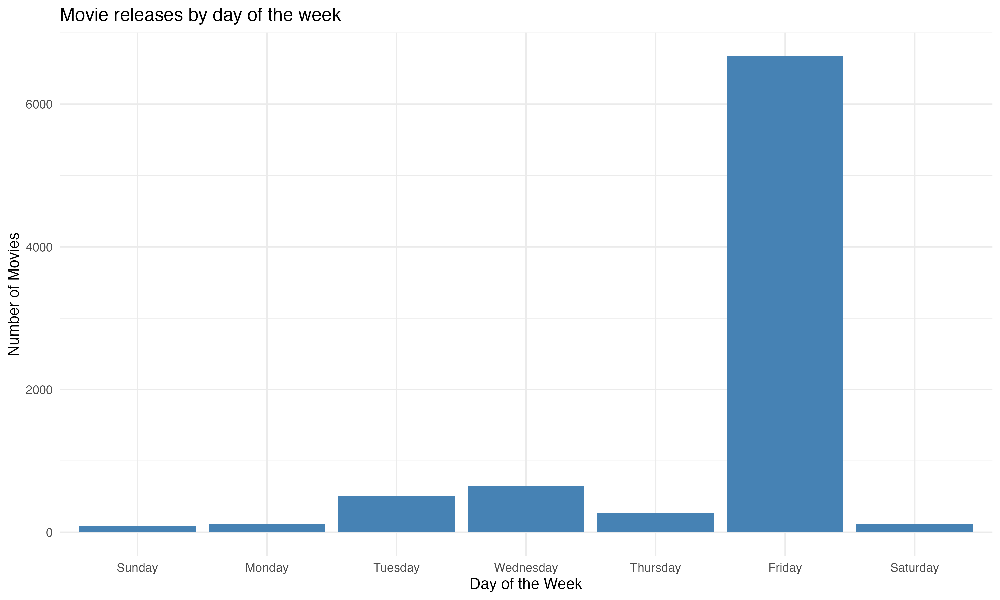
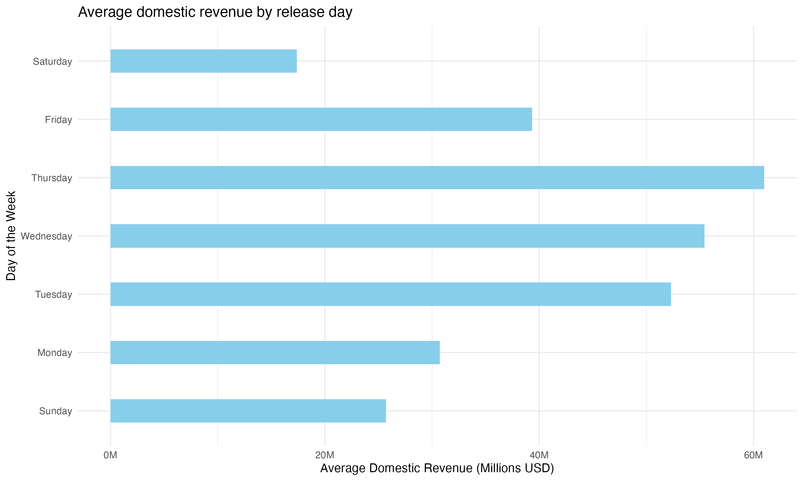
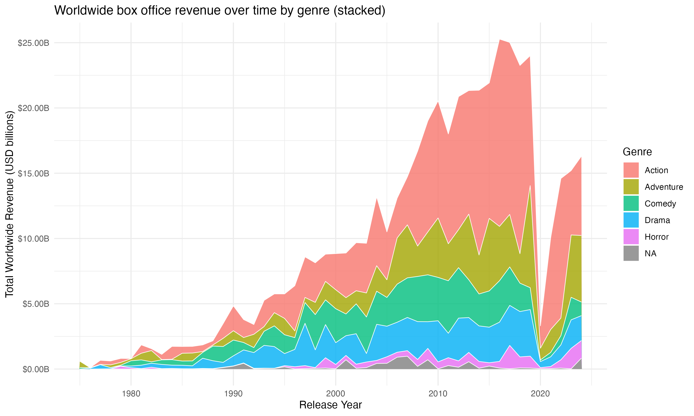
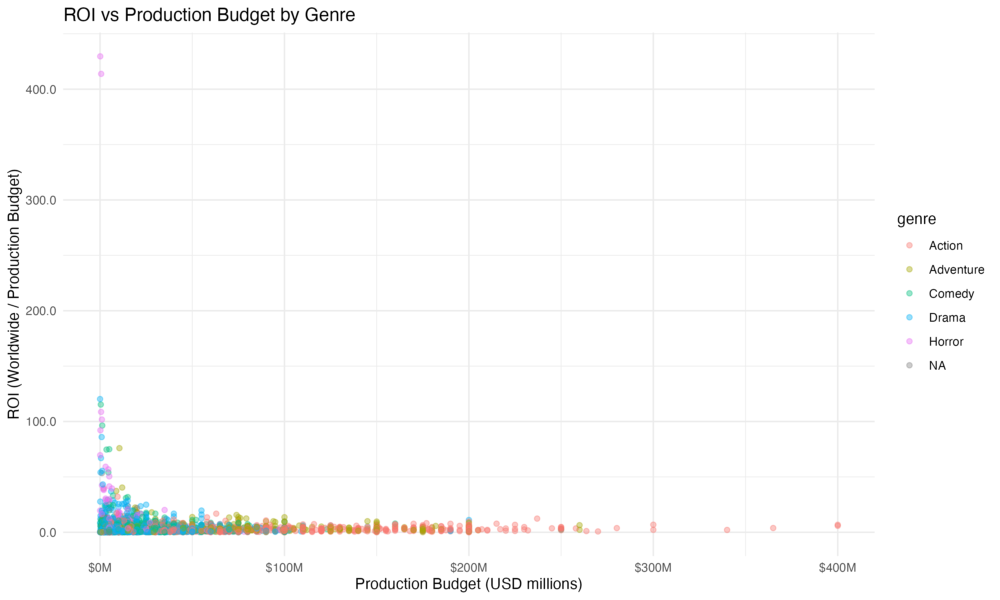
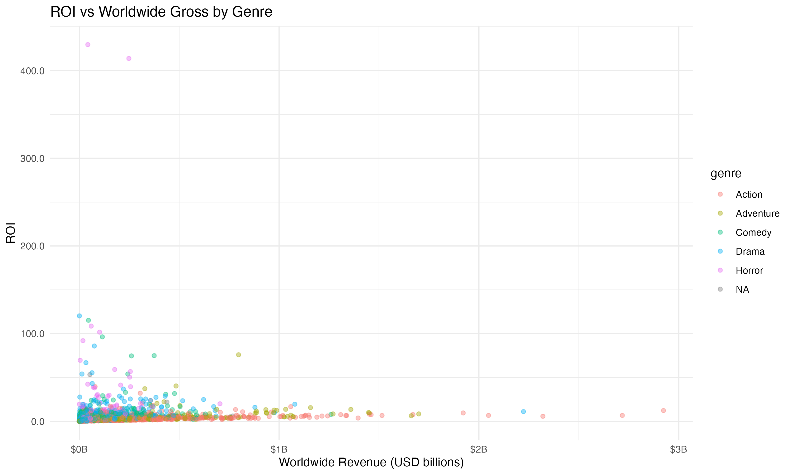
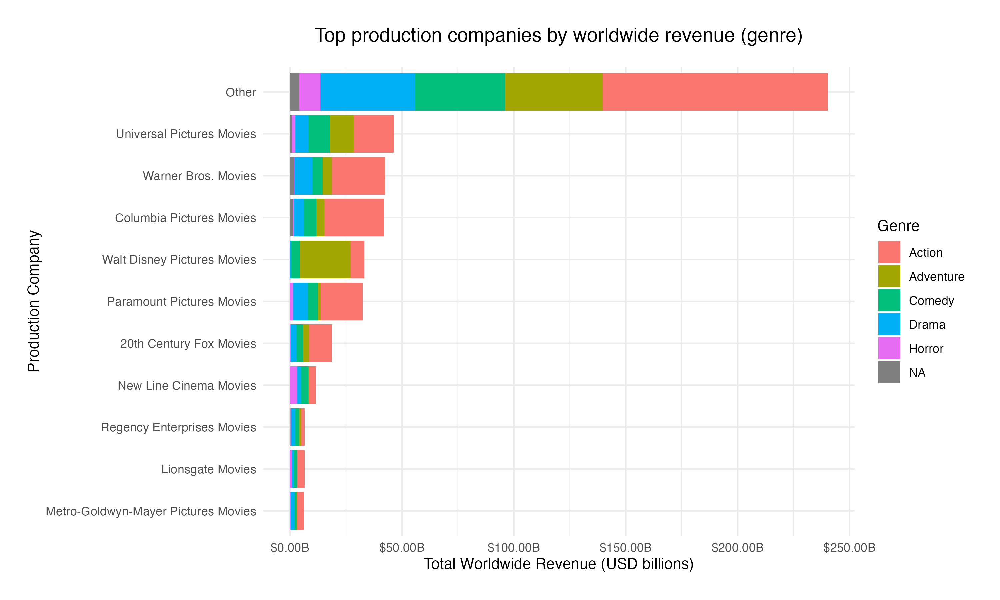

# IMDb Box Office & Movie Revenue Analytics

An exploratory data analytics project using IMDb movie metadata and movie budget datasets to uncover trends in movie release timing, box office performance, genre popularity, production company performance, and return on investment (ROI).

**Skills Demonstrated:** Data Cleaning • Data Wrangling • Exploratory Data Analysis (EDA) • Data Visualization • Statistical Analysis • Business Insights • R Programming

---

## Overview

This project combines IMDb movie metadata with production budget information to investigate factors influencing movie success. The analysis explores release strategies, seasonal revenue trends, genre performance, production company contributions, and profitability patterns using data-driven visualizations.

The project was developed in R and demonstrates end-to-end analytics capabilities including data cleaning, transformation, dataset integration, exploratory analysis, and business insight generation.

---

## Tools & Technologies

* R
* Tidyverse
* dplyr
* ggplot2
* Lubridate
* Janitor
* Stringr
* Data Visualization
* Exploratory Data Analysis (EDA)

---

## Dataset

The project combines:

* IMDb movie metadata
* Movie production budget data

Data preprocessing included:

* Cleaning column names
* Standardizing date formats
* Handling missing values
* Creating derived variables
* Joining datasets using movie title and release year

After cleaning and integration, the final analytical dataset contained **8,388 matched movie records** spanning multiple decades of movie releases.

---

## Key Analyses

### Movie Releases by Day of Week

Analyzed the distribution of movie release dates to identify preferred release strategies used by studios.

### Domestic Revenue by Release Day

Examined whether movie release timing influences domestic box office performance.

### Domestic Box Office Trends by Month

Investigated seasonal patterns in movie revenues across different months of the year.

### Worldwide Revenue by Genre

Compared genre performance over time to identify long-term shifts in audience preferences.

### Return on Investment (ROI)

Evaluated movie profitability through:

* Production Budget vs ROI
* Worldwide Revenue vs ROI

### Top Production Companies

Compared worldwide revenue generated by major movie studios across genres.

---

## Key Findings

* Friday is the most common movie release day.
* Thursday releases generated the highest average domestic revenue.
* June, July, November, and December produced the strongest domestic box office results.
* Action and Adventure genres dominate worldwide revenue generation.
* Horror films often deliver the highest ROI despite smaller production budgets.
* Walt Disney Pictures, Universal Pictures, and Warner Bros. are major contributors to global box office success.
* Seasonal release timing appears to play a significant role in movie performance.

---
## Visualizations

### Movie Releases by Day of Week



### Average Domestic Revenue by Release Day



### Domestic Box Office Trends by Month


### Worldwide Revenue by Genre



### ROI vs Production Budget



### ROI vs Worldwide Gross



### Top Production Companies



---

## Repository Structure

```text
IMDb Box Office & Movie Revenue Analytics
│
├── data
│   ├── movies.csv
│   └── budget.csv
│
├── notebooks
│   ├── Saurabh_Kumar_35167254_Assignment2.Rmd
│   └── Saurabh_Kumar_35167254_Assignment2.pdf
│
├── outputs
│   ├── Movie_releases_by_day_of_the_week.png
│   ├── Average_domestic_revenue_by_release_day.png
│   ├── Domestic_box_office_trends_by_month.png
│   ├── Worldwide_box_office_revenue_over_time_by_genre.png
│   ├── ROI_vs_Production_Budget_by_Genre.png
│   ├── ROI_vs_Worldwide_Gross_by_Genre.png
│   └── Top_production_companies_by_worldwide_revenue.png
│
├── LICENSE
│
└── README.md
```
---

## Business Value

This analysis demonstrates how data analytics can be used to:

* Identify optimal movie release strategies
* Understand seasonal revenue trends
* Evaluate profitability drivers
* Compare studio performance
* Assess genre-level market opportunities
* Generate actionable business insights from large datasets

---

## Author

**Saurabh Kumar**

Master of Business (Data Analytics for Business)
Monash University

**Technical Skills:**
R • SQL • Python • Power BI • Tableau • Excel • Data Analytics • Data Visualization • Statistical Analysis

